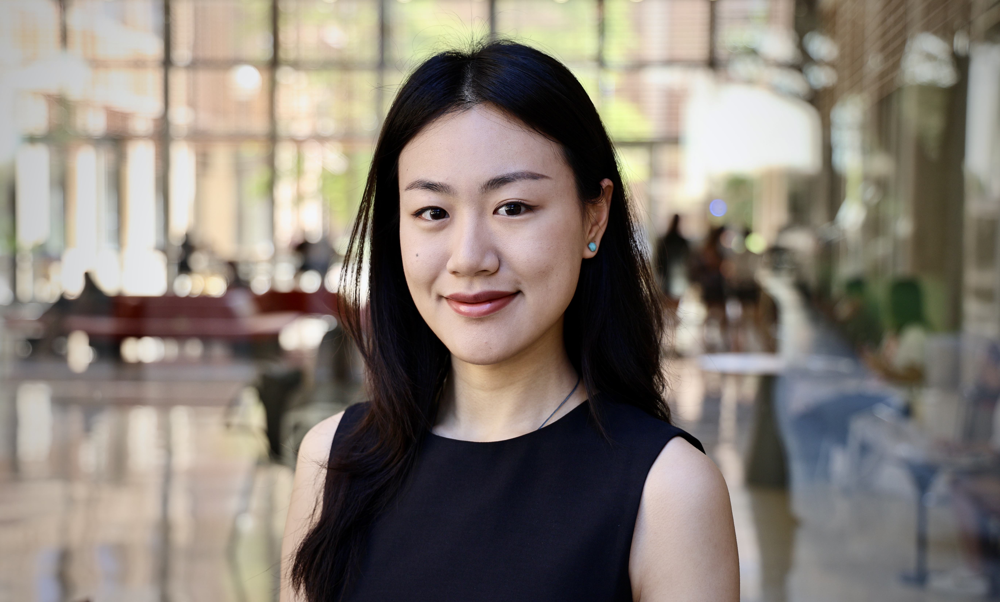

 
    

 <b>Xindi Gong, PhD Student</b>

 <a href="https://oden.utexas.edu" target="blank">Oden Institute for Computational Engineering and Sciences</a> 
<a href="https://utexas.edu" target="blank">The University of Texas at Austin</a>  
<a href="https://www.oden.utexas.edu/people/directory/Xindi-Gong/" target="blank">Student Page</a> 

 

I obtained my Bachelor of Science in Applied Mathematics and Statistics from [Emory University](http://emory.edu/) in 2022.

I am now a PhD student at the [Oden Institute for Computational Engineering and Sciences](http://oden.utexas.edu/) of [The University of Texas at Austin](http://utexas.edu/) supervised by [Prof. Omar Ghattas](http://users.oden.utexas.edu/~omar). My current research interests include inverse problems and uncertainty quantification. I am also very interested in surrogate models for complex systems.  
